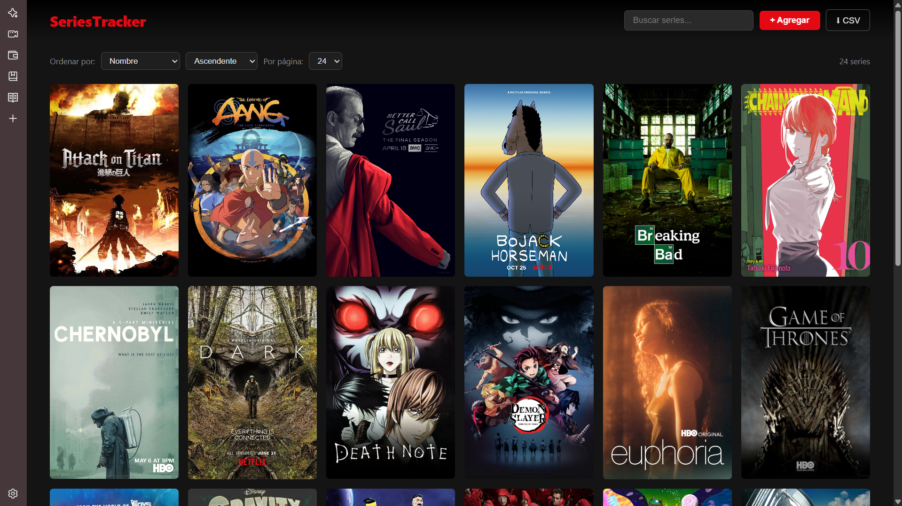

# Series Tracker — Frontend

Cliente web para el Series Tracker, construido con HTML, CSS y JavaScript vanilla. Consume la API REST del backend usando `fetch()`.

**Backend:** [proyecto1-STW-backend](https://github.com/Lazaroo1/proyecto1-STW-backend)  
 **App en producción:** https://lazaroo1.github.io/proyecto1-STW-frontend/

## Screenshot



## Cómo correr localmente

```bash
git clone https://github.com/Lazaroo1/proyecto1-STW-frontend
cd proyecto1-STW-frontend
```

Abre `index.html` con Live Server en VS Code o cualquier servidor estático. Para apuntar al backend local cambia la primera línea de `js/api.js`:

```javascript
const BASE_URL = 'http://localhost:8080';
```

## Estructura del proyecto

```
.
├── index.html
├── css/
│   └── style.css
└── js/
    ├── api.js    # Todas las llamadas fetch al backend
    └── app.js    # Lógica de UI y manipulación del DOM
```

## Funcionalidades

- Ver todas las series en cards estilo app de streaming
- Agregar, editar y eliminar series
- Barra de progreso por serie
- Sistema de rating de 1 a 10 estrellas
- Búsqueda en tiempo real
- Ordenar por nombre, episodios o total
- Paginación
- Exportar lista a CSV

## Challenges implementados

| Challenge | Puntos |
|---|---|
| Calidad visual (estilo streaming app) | 30 |
| Organización del código en archivos | 20 |
| Exportar a CSV desde JavaScript puro | 20 |
| **Total** | **70** |

## Reflexión

Hacer el frontend sin ningún framework fue más desafiante de lo esperado, especialmente el manejo del estado (página actual, filtros, búsqueda) sin ninguna librería de ayuda. Pero fue muy valioso entender cómo funciona el DOM y `fetch()` a fondo. El diseño estilo como de Netflix fue lo más entretenido de implementar. Lo volvería a hacer en vanilla JS para proyectos pequeños, pero para algo más grande ya justifica usar un framework.
